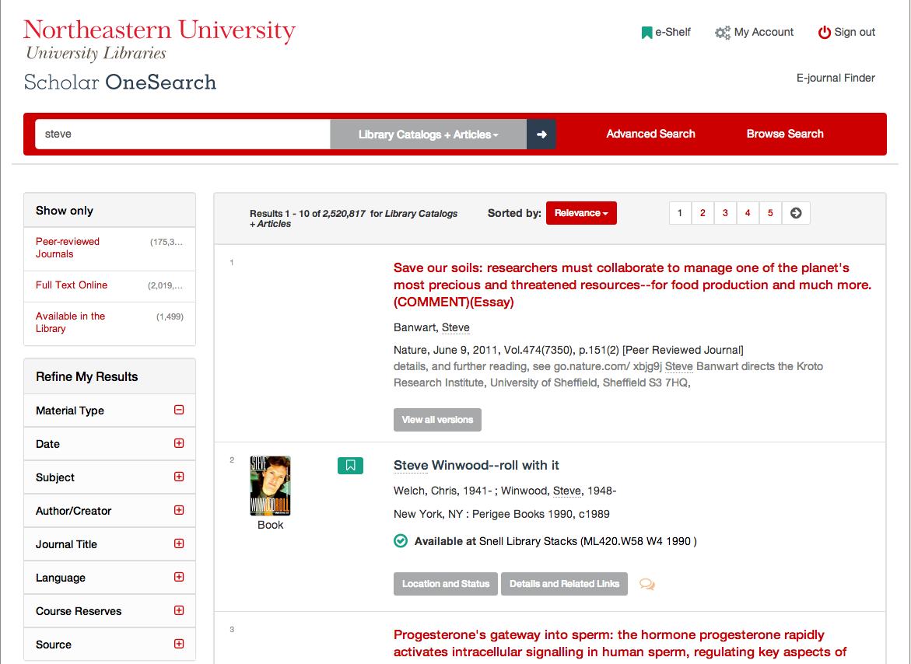
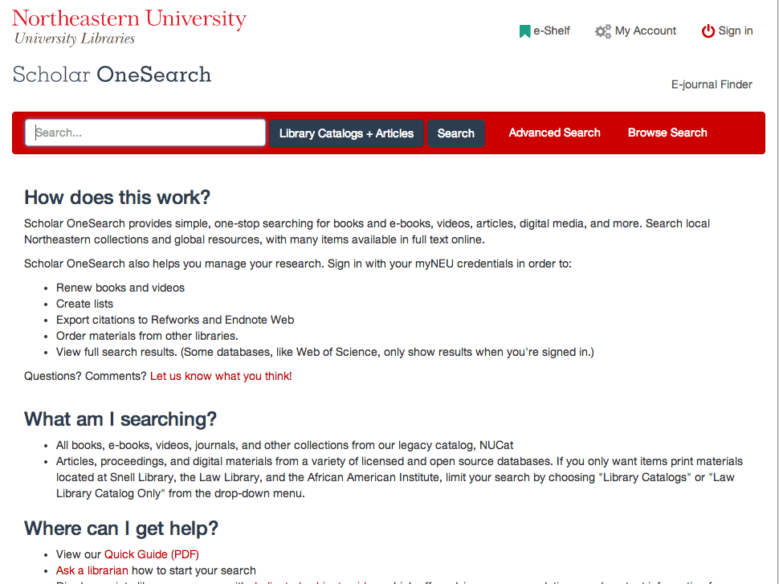
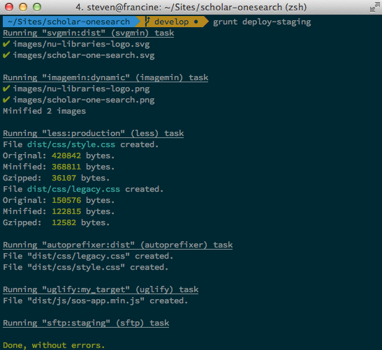
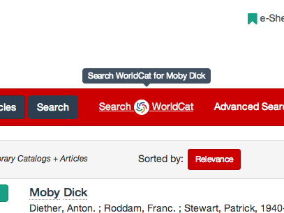

<h1>
  
</h1>

*Tackling the Primo Front-End.*

#### [Northeastern University Libraries](http://library.northeastern.edu)

#### Steven Bassett - [@bassettsj](http://twitter.com/bassettsj)

----

## Slides Available

http://neu-libraries.github.io/scholar-onesearch

----

## What is the *Front-end*?

> A mix of programming and layout that powers the visuals and interactions of the web.

<cite>
[What Is: Front-End Web Developmentt](http://blog.generalassemb.ly/what-is-front-end-web-development/)
</cite>


Components of the web today `<HTML/>`, `CSS` & `JavaScript`.

---


<cite>
  [Flickr/Selbe B](http://goo.gl/FJNPGJ)
</cite>

Note:
Pretend a website is a car. There are a lot of things inside of a car that help it run – make it speed up, slow down, even keep on the lights. All of these things you can’t really see – but are really important – that’s the back-end.

But then there are items that you directly use in the car to make it go: your gas and brake pedals, the steering wheel. And there are also a lot of things on that car that make it fun to drive and cool to look at: a racing stripe, a slick leather interior. All the stuff you can directly touch, see or hear? That’s the front end.

Cite: http://blog.generalassemb.ly/what-is-front-end-web-development/

----

## ~~Bashing~~ Ex Libris


<cite>[Flickr/trixer](http://www.flickr.com/photos/trixer/3531445744)</cite>

Note: Northeastern University Libraries is not bashing ExLibris as a company the purpose of this presentation is to bring in some new ideas while using the current Primo platform and UI, but trying to optimize the user experience as much as we can within the constraints of the project.

----

### The "Front-End" should be ###

<ul>
  <li class="fragment">Modular / Scalable</li>
  <li class="fragment">Standards Compliant</li>
  <li class="fragment">Performant</li>
  <li class="fragment">Responsive</li>
</ul>

Note:

* Modular / Scalable
  * SMACCs - or Scalable Modular Architecture for CSS
  *
* Standards Compliant
  * Open Web Standards
* Performant
  * Front End Web Performance 
  * 
* Responsive
  

---
### Scalable / Modular

```css
 #exlidAdvancedSearchTile
  #exlidAdvancedSearchRibbon 
    div.EXLSearchFieldRibbonFormFieldsGroup1
      div.EXLAdvancedSearchFormRow
        .EXLAdvancedSearchFormRowInlineInput:first-of-type input,
#exlidAdvancedSearchTile
  #exlidAdvancedSearchRibbon
    div.EXLSearchFieldRibbonFormFieldsGroup1
      div.EXLAdvancedSearchFormRow
        .EXLAdvancedSearchFormRowInlineInput:first-of-type select {
  margin-left: 0;
}
```

Extending styles become chaotic at best.

Note: If the default CSS is structured in such a way that you need to override the style of elements with such long selectors, it restricts an organization from extending and adding features as the Primo implementation grows or by trying to tailor their primo instance. The default styles are written in a way that overriding the properties requires so much hacking that the system becomes unmanageable.

---

### Scalable / Modular

```
  {.EXLCitationLinkerTabsRibbon div li.EXLCitationLinkerSelectedTab}
  AND {.EXLFindDBTabsRibbon div li.EXLFindDBSelectedTab} share 15 rules
  
  {.EXLCitationLinkerTabsRibbon div li.EXLCitationLinkerTab}
  AND {.EXLFindDBTabsRibbon div li.EXLFindDBTab} share 12 rules
  
  {* html #exliGreyOverlay iframe} 
  AND {* html #exliLoadingFdb iframe} share 12 rules
```
Results from [CSSCSS](http://zmoazeni.github.io/csscss/).

Note:


---

### Scalable / Modular

What if you don't want all of to change the primary color in the design?


```
 Search for "#e87107"
 ....
 1797: .EXLMyAccountMainContainer form input.submit { 
        background-color:#e87107;  
      }
 .... 

38 matches across 4 files
```

---

### Web Standards


Note: Simple issues like using duplicate IDs in the HTML markup create a barrier for Primo adopting institutions to be able to tailor their experience to their users.

--- 

### Web Standards


    
Note:

---

### Performance

<iframe width="1280" height="720" src="//www.youtube.com/embed/I2MJiJxGQsY" frameborder="0" allowfullscreen data-autoplay class="stretch"></iframe>

---

### Responsive

*Well sort of*

[](http://goo.gl/dlaVbp "Spring Load - Example of layouts")

There are really only two breakpoints in the design.

Note:

---

### Responsive *Images*


----

### Our Previous process

Business as Usual

* Overriding with specificity
* Not using a CSS preprocessor
* Little inclusion of client-side JS

--- 

### Results


No real  advantage over the default styles.


Note: The minute changes made in the design to help make the Primo interface match our organization's needs and identity  were not only ineffective but painstaking to take time to override the icon clad and ill crafted styles.


----

## The First Release


---

### The Process

* Changes and desires to change the user-experience out-weighed the old process.
* Looked to tool to fill the gaps

---

### Tools Used

- [Bootstrap](http://getbootstrap.com/)
- [LESS - CSS Preprocessor](http://lesscss.org/)
- [Font-Awesome Icon Font](http://fontawesome.io/)
- [jQuery](http://jquery.com/)
- [Modernizr](http://modernizr.com/)

Note:

* Modernizr
    * Feature detection library in JavaScript
   


---- 

### The Results



Note:
>With the launch of Alma on July 1, 2013, Northeastern University Libraries introduced the new Scholar OneSearch, a Primo installation featuring responsive and user-friendly design.

>Scholar OneSearch also improves upon some of the features in the standard Primo release, including a reorganized page header, collapsible facets in the left-hand “refine my results” sidebar, and integrated feedback into each search result.

---

### Use of iconography


---

### Responsive Design


---


### Added Features


---- 

## Evaluating the Result

* Pros
  * _More_ responsive
  * Updated Iconography
  * Closer to the Northeastern brand
  * Modern feel
  * Issue reporting
* Cons
  * Greater complexity in CSS
  * Fatter page weights
  * Unmaintainable in the long term

---- 

## Evaluating the process
#### Design Smarter, *Not* Harder

* Automate
* Simplify
* Organize

----

### What you can't change
- `</HTML>`
- `vendor.js`

### & what can change
- `CSS`
- `application.js`

----

### Organizing style sheets

```
less/
  |-base/
  |-components/
  |-legacy/
  |-library/
  |-sections/
  |-utilities/
  |-vendor/
  - legacy.less
  - style.less
```

Note:

----

### Separate Library Code

For Example
* [Bootstrap (3.x)](http://getbootstrap.com)
* [Font-Awesome (3.2.1)](http://fontawesome.io)

```less
// Core CSS
@import "../../bootstrap/less/scaffolding";
@import "../../bootstrap/less/type";
//@import "../../bootstrap/less/code";
``` 
Stored in separate git submodules.

Note:
Allowing for upgrading in the future, using a simple git submodule as a way to manage the vendors package. Alternatively could have used another package manager.

- Select what components are needed for the project.

----

### `LESS` Variables and Mixins

```less
//variables
@brand-primary:         #CC0000; // Northeastern's Red

//mix-ins
.EXLResultsTile{
  .make-lg-column(9); //creating a grid
}
```

Customization and time saving utilities.

Note:

---
### `LESS` Variables change ###



Note:
```
@brand-primary: @whestria;//#CC0000;
```

----

### *Legacy* Styles

```less
#exlidSkipToSystemFeedback a:active, #exlidSkipToSystemFeedback a:focus {
  position: static;
  width: auto;
  height: auto;
  margin-left: 1em;
}
// NO LONGER DELIVERED TO THE BROWSER
// /*-------------topbar-------------*/
// #exlidHeaderContainer {
//   height: auto;
//   width: 100%;
//   background-color: #FFFFFF;
// }

```
Note:
Blocking out entire sections of the legacy code can be easily managed by using LESS style comments to reduce the complexity of the code.


---

### *Legacy* Styles

```
Running "less:production" (less) task
File dist/css/style.css created.
Original: 436832 bytes.
Minified: 383544 bytes.
File dist/css/legacy.css created.
Original: 148370 bytes.
Minified: 121066 bytes.

Done, without errors.
```


----

### Organizing Application JavaScript

```js
var scholarOneSearch = (function(){
  var buildFacetCollapse = function(){...}; 
  var init = function(){ ... }; // Initializing functions
  return {
    init: init,
    buildFacetCollapse: buildFacetCollapse
  };
})();

window.scholarOneSearch = scholarOneSearch;
$(document).ready(scholarOneSearch.init);
```
<small>[The Module Pattern](http://learn.jquery.com/code-organization/concepts/)</small>

Note:
Even though the simplicity of the javascript hardly requires much oranization, starting a project that is expected to grow with organization im mind is a great ideas.

----

### Legacy Browser Support

*What about IE7?*

[](http://modernizr.com/)

Test for support and load fixes, eg [`respond.js`](https://github.com/scottjehl/Respond)

----

### Automate

[](http://gruntjs.com/)

---

### Tasks ✔



----

### Future/Current Release
 


---

### Responsive Design


---

### Updated components


Note:

---

### Contributed Code



----
## The future?

<ul>
  <li class="fragment">Is there a need?</li>
  <li class="fragment">Collaboration</li>
  <li class="fragment">Working with Ex Libris</li>
</ul>

---

### Is there a need?

[]( https://github.com/NEU-Libraries/scholar-onesearch)

If your interested in this project, [star it, fork it and/or use it][sos-gh-page], or you can [let us know.](http://library.northeastern.edu/contact)

[sos-gh-page]: https://github.com/NEU-Libraries/scholar-onesearch "Scholar OneSearch Project Page - Github"

---

### Collaboration

- Feature parody through tracking changes in primo upgrades.
- Progressive updates following best practices
- Even feature additions in the future built in a modular pattern.

----

### Solutions for Ex Libris ###

* Base theme, *not* a complete theme.
* Provide CSS in a pre-processor format for flexibility.
* [Scalable and Modular Architecture for CSS ](http://smacss.com/).
* Allow for user contributions and suggestions directly, similar to github.

----

### Further Resources

* [Bootstrap - Front-end framework](http://getbootstrap.com/)
* [LESS - CSS Preprocessorr](http://lesscss.org/)
* [CSS Lint](http://csslint.net/)
* [JShint](http://www.jshint.com/)
* [Scalable and Modular Architecture for CSS](http://smacss.com)
* [*Responsive Design* - A List Apart](http://alistapart.com/article/responsive-web-design)
* [Modernizr - Feature Detection Library ](http://modernizr.com/)
* [Respond.js - polyfill for min/max-width CSS3 Media Queries](https://github.com/scottjehl/Respond)
* [Grunt.js  Task Runner ](http://gruntjs.com/)
* [jQuery Learning Center ](http://learn.jquery.com/)


