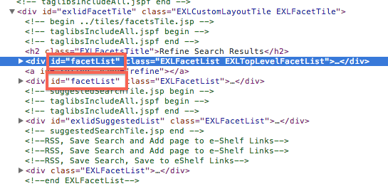
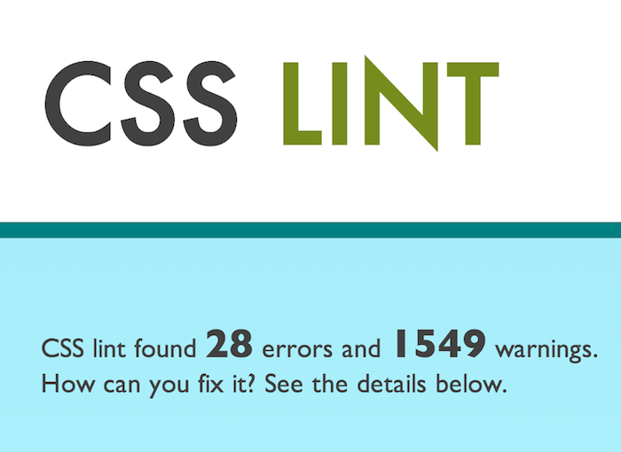
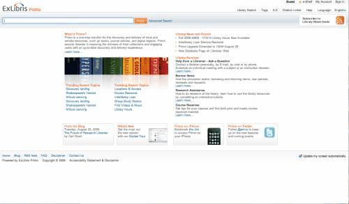
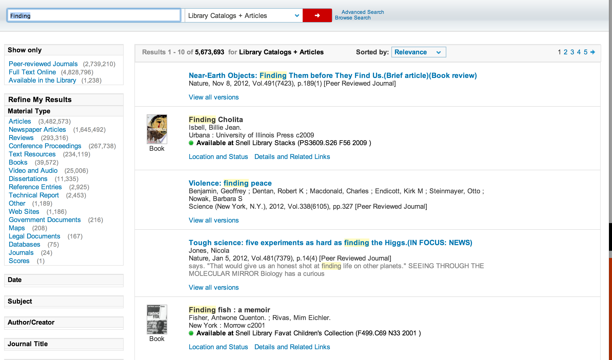
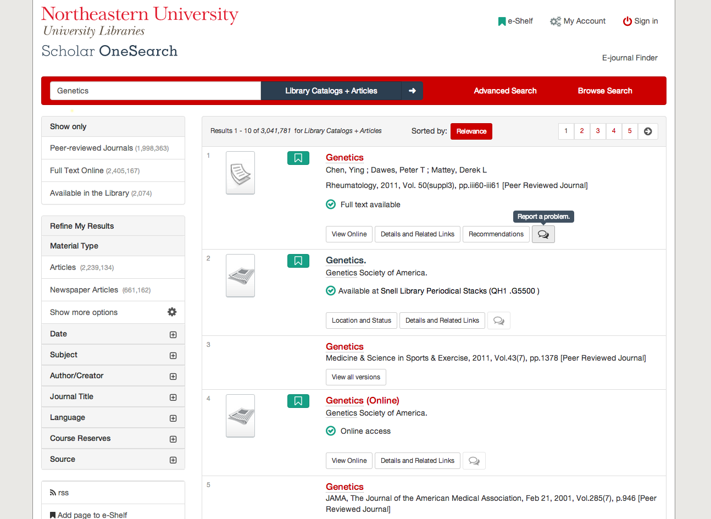
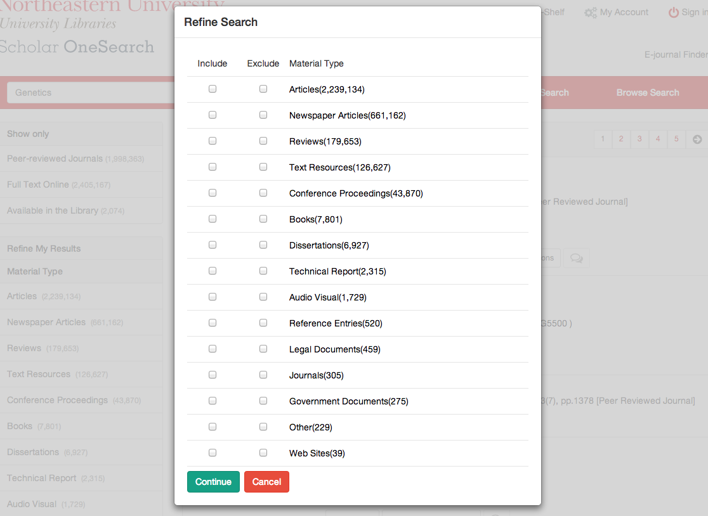
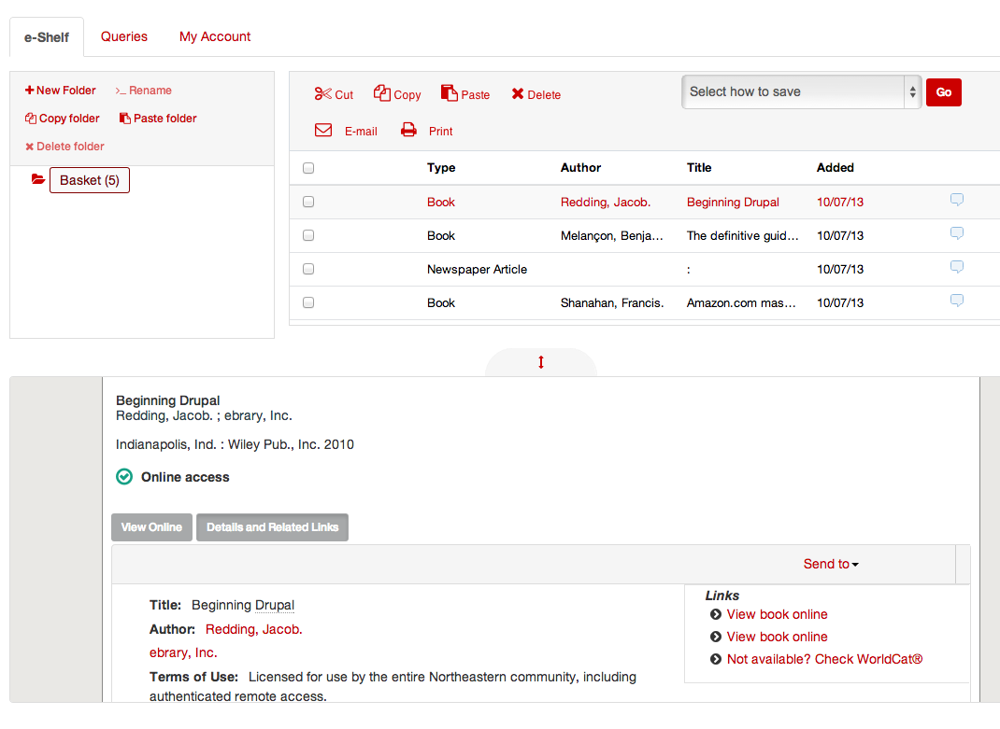
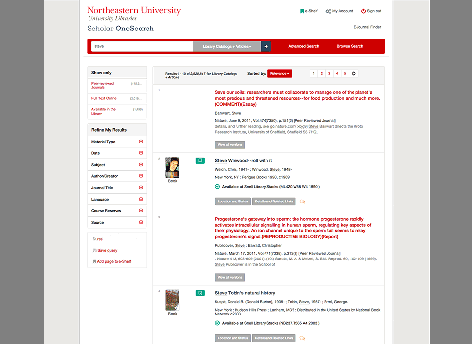
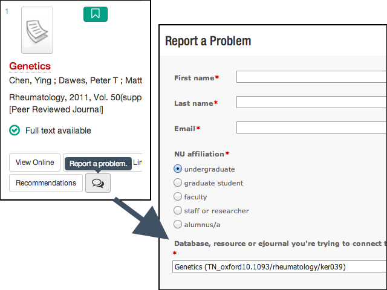
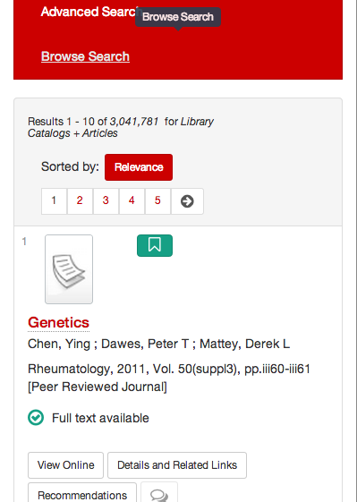

<h1>
  
</h1>

*Tackling the Primo user experience.*

#### [Northeastern University, Universtiy Libraries](http://library.northeastern.edu)

##### Steven Bassett - [@bassettsj](http://twitter.com/bassettsj)

----

## Slides Available

http://neu-libraries.github.io/scholar-onesearch

----

## ~~Bashing~~ Ex Libris


<cite>[Flickr/trixer](http://www.flickr.com/photos/trixer/3531445744)</cite>

Note: Northeastern University Librares is not bashing ExLibris as a company the purpose of this presentation is to bring in some new ideas while using the current Primo platform and UI, but trying to optimize the user experience as much as we can within the constraints of the project.

----

## The problem with the default.

<ul>
  <li class="fragment">Not
    <ul>
      <li class="fragment">Scalable</li>
      <li class="fragment">Modular</li>
      <li class="fragment">Semantic</li>
      <li class="fragment">Performanent</li>
      <li class="fragment">Responsive</li>
      <li class="fragment">Inflexible</li>
      <li class="fragment">Not Retina Ready</li>
      
    </ul>
  </li>
</ul>

Note:
Scalable the code is not scalable in the sense 

---
### Scalable

```css
 #exlidAdvancedSearchTile
  #exlidAdvancedSearchRibbon 
    div.EXLSearchFieldRibbonFormFieldsGroup1
      div.EXLAdvancedSearchFormRow
        .EXLAdvancedSearchFormRowInlineInput:first-of-type input,
#exlidAdvancedSearchTile
  #exlidAdvancedSearchRibbon
    div.EXLSearchFieldRibbonFormFieldsGroup1
      div.EXLAdvancedSearchFormRow
        .EXLAdvancedSearchFormRowInlineInput:first-of-type select {
  margin-left: 0;
}
```

**Don't do this!**
Note: If the default CSS is structured in such a way that you need to override the style of elements with such long selectors, it restricts an organization from extending and adding features as the Primo implemention grows.

---

### Modularity

```
  {.EXLCitationLinkerTabsRibbon div li.EXLCitationLinkerSelectedTab}
  AND {.EXLFindDBTabsRibbon div li.EXLFindDBSelectedTab} share 15 rules
  
  {.EXLCitationLinkerTabsRibbon div li.EXLCitationLinkerTab}
  AND {.EXLFindDBTabsRibbon div li.EXLFindDBTab} share 12 rules
  
  {* html #exliGreyOverlay iframe} 
  AND {* html #exliLoadingFdb iframe} share 12 rules
```

**Don't repeat yourself**

---

### Semantic



Note: Simple issues like using duplicate IDs in the HTML markup create a barrier for Primo adopting institutions to be able to tailor their experience to their users.

--- 

### Semantic CSS


    
Note:

---

### Performance

<iframe width="1280" height="720" src="//www.youtube.com/embed/I2MJiJxGQsY" frameborder="0" allowfullscreen data-autoplay class="stretch"></iframe>

---

### Responsive Design

*Well sort of*



There are really only two breakpoints in the design.

Note:

---

### Inflexible

What if you don't want all of primo's features?

```css
/* Removing location tab using CSS */
.EXLTabsRibbon div li.EXLLocationsTab {
  display:none
}

```

---

### Retina Ready


----

### Our Previous process

Business as Usual

* Overriding with specificity
* Not using a CSS preprocessor
* Little inclusion of client-side JS

--- 

### Results


<div class="fragment fade-in">
    
</div>
<p class="fragment fade-in">
  No real  advantage over the default styles.
</p>

Note: The minute changes made in the design to help make the Primo interface match our organization's needs and identity  were not only ineffective but painstaking to take time to override the icon clad and ill crafted styles.


----

## The First Release

---

### The Process

* Changes and desires to change the user-experience out-weighed the old process.
* Looked to tool to fill the gaps

---
### Tools Used

Reevaluated and included some contributed libraries:

- [Bootstrap](http://getbootstrap.com/)
- [LESS - CSS Preprocessor](http://lesscss.org/)
- [Font-Awesome Icon Font](http://fontawesome.io/)
- [jQuery](http://jquery.com/)
- [Modernizr](http://modernizr.com/)

---- 

### The Results



Note:
>With the launch of Alma on July 1, 2013, Northeastern University Libraries introduced the new Scholar OneSearch, a Primo installation featuring responsive and user-friendly design.

>Scholar OneSearch also improves upon some of the features in the standard Primo release, including a reorganized page header, collapsable facets in the left-hand “refine my results” sidebar, and integrated feedback into each search result.

---

### Updated components



Note:

---

### Use of iconography



---

### Responsive Design



---


### Added Features



---- 

## Evaluating the Result

* `Primo_default.3.0.css` + `bootstrap.css` + `additional-styles.css` = BIGGER Problem
* Bloating the page weight
* Much of the new theme is used to "de-suck" the original design.


---- 

## Evaluating the process
#### Design Smarter, *Not* Harder
* Adding too much bloat
* Not enough separation with client libraries
* Not enough automation in the build process.

----

### What you can't change
- `</HTML>`
- `vendor.js`

### & what can change
- `CSS`
- `application.js`

--- 


---- 
Future/Current Release


---
### Responsive Design



---


----
### JavaScript

----
### Legacy CSS


----
## Design Process


----
## Tooling

----
### Bootstrap

----
### Less CSS

----
### grunt.js

----
### Modernizr

----
### jQuery


----
## What was learned

----
## The Future?

----
### Community Buy In

----
### Collaboration to build a new default alternative
