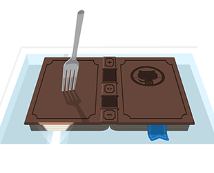

<h1>
  
</h1>

*Tackling the Primo user experience.*

#### [Northeastern University, Universtiy Libraries](http://library.northeastern.edu)

##### Steven Bassett - [@bassettsj](http://twitter.com/bassettsj)

----

## Slides Available

http://neu-libraries.github.io/scholar-onesearch

----

## ~~Bashing~~ Ex Libris


<cite>[Flickr/trixer](http://www.flickr.com/photos/trixer/3531445744)</cite>

Note: Northeastern University Librares is not bashing ExLibris as a company the purpose of this presentation is to bring in some new ideas while using the current Primo platform and UI, but trying to optimize the user experience as much as we can within the constraints of the project.

----

## The problem with the default.

<ul>
  <li class="fragment">Not
    <ul>
      <li class="fragment">Scalable</li>
      <li class="fragment">Modular</li>
      <li class="fragment">Semantic</li>
      <li class="fragment">Performanent</li>
      <li class="fragment">Responsive</li>
      <li class="fragment">Inflexible</li>
      <li class="fragment">Not Retina Ready</li>
      
    </ul>
  </li>
</ul>

Note:
Scalable the code is not scalable in the sense 

---
### Scalable

```css
 #exlidAdvancedSearchTile
  #exlidAdvancedSearchRibbon 
    div.EXLSearchFieldRibbonFormFieldsGroup1
      div.EXLAdvancedSearchFormRow
        .EXLAdvancedSearchFormRowInlineInput:first-of-type input,
#exlidAdvancedSearchTile
  #exlidAdvancedSearchRibbon
    div.EXLSearchFieldRibbonFormFieldsGroup1
      div.EXLAdvancedSearchFormRow
        .EXLAdvancedSearchFormRowInlineInput:first-of-type select {
  margin-left: 0;
}
```

**Don't do this!**
Note: If the default CSS is structured in such a way that you need to override the style of elements with such long selectors, it restricts an organization from extending and adding features as the Primo implemention grows.

---

### Modularity

```
  {.EXLCitationLinkerTabsRibbon div li.EXLCitationLinkerSelectedTab}
  AND {.EXLFindDBTabsRibbon div li.EXLFindDBSelectedTab} share 15 rules
  
  {.EXLCitationLinkerTabsRibbon div li.EXLCitationLinkerTab}
  AND {.EXLFindDBTabsRibbon div li.EXLFindDBTab} share 12 rules
  
  {* html #exliGreyOverlay iframe} 
  AND {* html #exliLoadingFdb iframe} share 12 rules
```

**Don't repeat yourself**

---

### Semantic


Note: Simple issues like using duplicate IDs in the HTML markup create a barrier for Primo adopting institutions to be able to tailor their experience to their users.

--- 

### Semantic CSS


    
Note:

---

### Performance

<iframe width="1280" height="720" src="//www.youtube.com/embed/I2MJiJxGQsY" frameborder="0" allowfullscreen data-autoplay class="stretch"></iframe>

---

### Responsive Design

*Well sort of*


There are really only two breakpoints in the design.

Note:

---

### Inflexible

What if you don't want all of primo's features?

```css
/* Removing location tab using CSS */
.EXLTabsRibbon div li.EXLLocationsTab {
  display:none
}

```

---

### Retina Ready


----

### Our Previous process

Business as Usual

* Overriding with specificity
* Not using a CSS preprocessor
* Little inclusion of client-side JS

--- 

### Results


<div class="fragment fade-in">
    
</div>
<p class="fragment fade-in">
  No real  advantage over the default styles.
</p>

Note: The minute changes made in the design to help make the Primo interface match our organization's needs and identity  were not only ineffective but painstaking to take time to override the icon clad and ill crafted styles.


----

## The First Release

---

### The Process

* Changes and desires to change the user-experience out-weighed the old process.
* Looked to tool to fill the gaps

---
### Tools Used

Reevaluated and included some contributed libraries:

- [Bootstrap](http://getbootstrap.com/)
- [LESS - CSS Preprocessor](http://lesscss.org/)
- [Font-Awesome Icon Font](http://fontawesome.io/)
- [jQuery](http://jquery.com/)
- [Modernizr](http://modernizr.com/)

---- 

### The Results


Note:
>With the launch of Alma on July 1, 2013, Northeastern University Libraries introduced the new Scholar OneSearch, a Primo installation featuring responsive and user-friendly design.

>Scholar OneSearch also improves upon some of the features in the standard Primo release, including a reorganized page header, collapsable facets in the left-hand “refine my results” sidebar, and integrated feedback into each search result.

---

### Use of iconography


---

### Responsive Design


---


### Added Features


---- 

## Evaluating the Result

* Pros
  * _More_ responsive
  * Updated Iconography
  * Closer to the Northeastern brand
  * Modern feel
  * Issue reporting
* Cons
  * Greater complexity in CSS
  * Fatter page weights
  * Unmaintainable in the long term

---- 

## Evaluating the process
#### Design Smarter, *Not* Harder

* Automate
* Simplify
* Organize

----

### What you can't change
- `</HTML>`
- `vendor.js`

### & what can change
- `CSS`
- `application.js`

----

### Organizing style sheets

```
less/
  |-base/
  |-components/
  |-legacy/
  |-library/
  |-sections/
  |-utilities/
  |-vendor/
  - legacy.less
  - style.less
```

Note:

----

###Separate Library Code

* [Bootstrap (3.x)](http://getbootstrap.com)
* [Font-Awesome (3.2.1)](http://fontawesome.io)

```less
// Core CSS
@import "../../bootstrap/less/scaffolding";
@import "../../bootstrap/less/type";
//@import "../../bootstrap/less/code";
```

Note:
Allowing for upgrading in the future, using a simple git submodule as a way to manage the vendors package. Alternatively could have used another package manager.

- Select what components are needed for the project.

----

### `LESS` Variables and Mixins

```less
//variables
@brand-primary:         #CC0000; // Northeastern's Red

//mix-ins
.EXLResultsTile{
  .make-lg-column(9); //creating a grid
}
```

Customization and time saving utilties.
Note:

----

### Removing legacy styles progressively

```less
#exlidSkipToSystemFeedback a:active, #exlidSkipToSystemFeedback a:focus {
  position: static;
  width: auto;
  height: auto;
  margin-left: 1em;
}


// /*-------------topbar-------------*/
// #exlidHeaderContainer {
//   height: auto;
//   width: 100%;
//   background-color: #FFFFFF;
// }

```
Note:
Blocking out entire sections of the legacy code can be easily managed by using LESS style comments to reduce the complexity of the code.

----

### Organizing Application JavaScript

```js
var scholarOneSearch = (function(){
  var reportAProblem = function(){...}; 
  var init = function(){ ... }; // Initializing functions
  return {
    init: init,
    buildFacetCollapse: buildFacetCollapse
  };
})();

window.scholarOneSearch = scholarOneSearch;
$(document).ready(scholarOneSearch.init);
```
<small>[The Module Pattern](http://learn.jquery.com/code-organization/concepts/)</small>

Note:
Even though the simplicity of the javascript hardly requires much oranization, starting a project that is expected to grow with organization im mind is a great ideas.

----

### Legacy Browser Support

*What about IE7?*

[](http://modernizr.com/)

Test for support and load fixes, eg [`respond.js`](https://github.com/scottjehl/Respond)

----

### Automate

[](http://gruntjs.com/)

---

### Tasks ✔


----

### Future/Current Release
 


---

### Responsive Design


---

### Updated components


Note:

----
## The future?

<ul>
  <li class="fragment">Is there a need?</li>
  <li class="fragment">Collaboration</li>
  <li class="fragment">Working with Ex Libris</li>
</ul>

---

### Is there a need?

[]( https://github.com/NEU-Libraries/scholar-onesearch)

If your interested in this project, [star it, fork it and/or use it][sos-gh-page], or you can [let us know.](http://library.northeastern.edu/contact)

[sos-gh-page]: https://github.com/NEU-Libraries/scholar-onesearch "Scholar OneSearch Project Page - Github"

---

### Collaboration

- Feature parody through tracking changes in primo upgrades.
- Progressive updates following best practices
- Even feature additions in the future built in a modular pattern.

----

### Further Resources

* Bootstrap 3.x
* LESS
* CSS Lint
* JShint
* Scalable and Modular CSS
* Responsive Design
* Modernizr
* Respond.js
* Grunt.js Task Runner
* Learn jQuery
